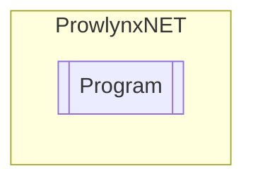

# Program `Internal class`

## Diagram


## Details
### Constructors
#### Program
[*Source code*](https://github.com///blob//ProwlynxNET.Core/ConsoleLogger.cs#L25)
```csharp
public Program()
```

*Generated with* [*ModularDoc*](https://github.com/hailstorm75/ModularDoc)
