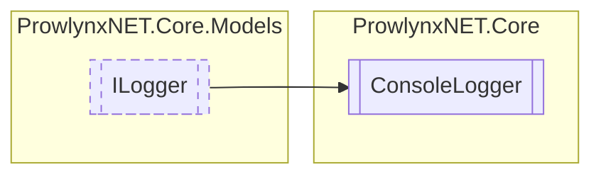

# ConsoleLogger `Public class`

## Description
A logger that logs exclusively to Console .

## Diagram


## Members
### Methods
#### Public  methods
| Returns | Name |
| --- | --- |
| `void` | [`LogDebug`](#logdebug)(`string` message)<br>Log debug message. |
| `void` | [`LogError`](#logerror)(`string` message)<br>Log an error. |
| `void` | [`LogInfo`](#loginfo)(`string` message)<br>Log information message. |
| `void` | [`LogSuccess`](#logsuccess)(`string` message)<br>Log a success message. |
| `void` | [`LogWarn`](#logwarn)(`string` message)<br>Log a warning. |

## Details
### Summary
A logger that logs exclusively to Console .

### Inheritance
 - [
`ILogger`
](models/ILogger.md)

### Constructors
#### ConsoleLogger
[*Source code*](https://github.com///blob//ProwlynxNET/Engine/Obfuscator.cs#L16707566)
```csharp
public ConsoleLogger()
```

### Methods
#### LogDebug
[*Source code*](https://github.com///blob//ProwlynxNET/Program.cs#L9)
```csharp
public virtual void LogDebug(string message)
```
##### Arguments
| Type | Name | Description |
| --- | --- | --- |
| `string` | message | The message to log. |

##### Summary
Log debug message.

#### LogInfo
[*Source code*](https://github.com///blob//ProwlynxNET.Core/ConsoleLogger.cs#L25)
```csharp
public virtual void LogInfo(string message)
```
##### Arguments
| Type | Name | Description |
| --- | --- | --- |
| `string` | message | The message to log. |

##### Summary
Log information message.

#### LogError
[*Source code*](https://github.com///blob//ProwlynxNET/Extensions/StringExtensions.cs#L23)
```csharp
public virtual void LogError(string message)
```
##### Arguments
| Type | Name | Description |
| --- | --- | --- |
| `string` | message | The message to log. |

##### Summary
Log an error.

#### LogSuccess
[*Source code*](https://github.com///blob//ProwlynxNET/Engine/Obfuscator.cs#L39)
```csharp
public virtual void LogSuccess(string message)
```
##### Arguments
| Type | Name | Description |
| --- | --- | --- |
| `string` | message | The message to log. |

##### Summary
Log a success message.

#### LogWarn
[*Source code*](https://github.com///blob//ProwlynxNET/Engine/Obfuscator.cs#L61)
```csharp
public virtual void LogWarn(string message)
```
##### Arguments
| Type | Name | Description |
| --- | --- | --- |
| `string` | message | The message to log. |

##### Summary
Log a warning.

*Generated with* [*ModularDoc*](https://github.com/hailstorm75/ModularDoc)
