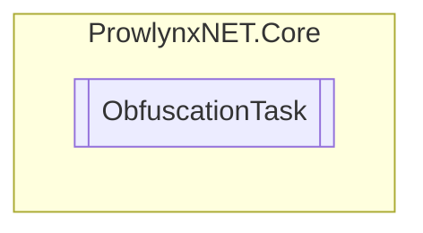

# ObfuscationTask `Public class`

## Description
The obfuscation task.

## Diagram


## Members
### Properties
#### Public  properties
| Type | Name | Methods |
| --- | --- | --- |
| [`ArgumentProvider`](serviceproviders/ArgumentProvider.md) | [`ArgumentProvider`](#argumentprovider)<br>The argument provider that provides arguments for [IProtection](models/IProtection.md) s. | `get, set` |
| [`AttributeArgumentProvider`](serviceproviders/AttributeArgumentProvider.md) | [`AttributeArgumentProvider`](#attributeargumentprovider)<br>The attribute argument provider for the task. | `get, set` |
| [`IAttributeArgumentService`](models/services/IAttributeArgumentServiceT.md)&lt;[`ArgumentInfo`](services/argument/ArgumentInfo.md)&gt; | [`AttributeArgumentService`](#attributeargumentservice)<br>The first IAttributeArgumentService from the [ObfuscationTask](prowlynxnet/core/ObfuscationTask.md).[AttributeArgumentProvider](#attributeargumentprovider) . | `get` |
| [`CryptoProvider`](serviceproviders/CryptoProvider.md) | [`CryptoProvider`](#cryptoprovider)<br>The cryptography provider for the task. | `get, set` |
| [`InjectionProvider`](serviceproviders/InjectionProvider.md) | [`InjectionProvider`](#injectionprovider)<br>The injection provider for the task. | `get, set` |
| [`IInjectionService`](models/services/IInjectionService.md) | [`Injector`](#injector)<br>The first [IInjectionService](models/services/IInjectionService.md) from the [ObfuscationTask](prowlynxnet/core/ObfuscationTask.md).[InjectionProvider](#injectionprovider) . | `get` |
| `string` | [`InputFile`](#inputfile)<br>The input file path, as provided. | `get, set` |
| `bool` | [`IsDotNetCoreModule`](#isdotnetcoremodule)<br>Whether the [ObfuscationTask](prowlynxnet/core/ObfuscationTask.md).[Module](#module) is a .NET Core module. | `get` |
| `bool` | [`IsDotNetFrameworkModule`](#isdotnetframeworkmodule)<br>Whether the [ObfuscationTask](prowlynxnet/core/ObfuscationTask.md).[Module](#module) is a .NET Framework module. | `get` |
| `bool` | [`IsDotNetStandardModule`](#isdotnetstandardmodule)<br>Whether the [ObfuscationTask](prowlynxnet/core/ObfuscationTask.md).[Module](#module) is a .NET Standard module. | `get` |
| [`ILogger`](models/ILogger.md) | [`Logger`](#logger)<br>The logger to use when logging information. | `get, set` |
| [`IMarkerService`](models/services/IMarkerService.md) | [`Marker`](#marker)<br>The first [IMarkerService](models/services/IMarkerService.md) from the [ObfuscationTask](prowlynxnet/core/ObfuscationTask.md).[MarkerProvider](#markerprovider) . | `get` |
| [`MarkerProvider`](serviceproviders/MarkerProvider.md) | [`MarkerProvider`](#markerprovider)<br>The marker provider for the task. | `get, set` |
| `ModuleDefinition` | [`Module`](#module)<br>The module for the task. | `get, set` |
| `List`&lt;`ModuleDefinition`&gt; | [`Modules`](#modules)<br>The modules for the whole process | `get, set` |
| `string` | [`OutputFile`](#outputfile)<br>The output filepath, as requested. | `get, set` |
| `ReferenceImporter` | [`Resolver`](#resolver)<br>The assembly resolver for the module. | `get, set` |
| `Guid` | [`TaskID`](#taskid)<br>The task identifier, unique per task. | `get` |

## Details
### Summary
The obfuscation task.

### Constructors
#### ObfuscationTask
[*Source code*](https://github.com///blob//ProwlynxNET.Core/ObfuscationTask.cs#L121)
```csharp
public ObfuscationTask(string inputFile, string outputFile, ILogger logger)
```
##### Arguments
| Type | Name | Description |
| --- | --- | --- |
| `string` | inputFile | The full filepath to the input file. |
| `string` | outputFile | The output filepath. |
| [`ILogger`](models/ILogger.md) | logger | The [ILogger](models/ILogger.md) instance. |

##### Summary
Creates a new obfuscation task and sets the InputFile, Module properties.

### Properties
#### TaskID
```csharp
public Guid TaskID { get; }
```
##### Summary
The task identifier, unique per task.

#### Module
```csharp
public ModuleDefinition Module { get; set; }
```
##### Summary
The module for the task.

#### Modules
```csharp
public List<ModuleDefinition> Modules { get; set; }
```
##### Summary
The modules for the whole process

#### IsDotNetCoreModule
```csharp
public bool IsDotNetCoreModule { get; }
```
##### Summary
Whether the [ObfuscationTask](prowlynxnet/core/ObfuscationTask.md).[Module](#module) is a .NET Core module.

#### IsDotNetStandardModule
```csharp
public bool IsDotNetStandardModule { get; }
```
##### Summary
Whether the [ObfuscationTask](prowlynxnet/core/ObfuscationTask.md).[Module](#module) is a .NET Standard module.

#### IsDotNetFrameworkModule
```csharp
public bool IsDotNetFrameworkModule { get; }
```
##### Summary
Whether the [ObfuscationTask](prowlynxnet/core/ObfuscationTask.md).[Module](#module) is a .NET Framework module.

#### Resolver
```csharp
public ReferenceImporter Resolver { get; set; }
```
##### Summary
The assembly resolver for the module.

#### CryptoProvider
```csharp
public CryptoProvider CryptoProvider { get; set; }
```
##### Summary
The cryptography provider for the task.

#### MarkerProvider
```csharp
public MarkerProvider MarkerProvider { get; set; }
```
##### Summary
The marker provider for the task.

#### Marker
```csharp
public IMarkerService Marker { get; }
```
##### Summary
The first [IMarkerService](models/services/IMarkerService.md) from the [ObfuscationTask](prowlynxnet/core/ObfuscationTask.md).[MarkerProvider](#markerprovider) .

#### InjectionProvider
```csharp
public InjectionProvider InjectionProvider { get; set; }
```
##### Summary
The injection provider for the task.

#### Injector
```csharp
public IInjectionService Injector { get; }
```
##### Summary
The first [IInjectionService](models/services/IInjectionService.md) from the [ObfuscationTask](prowlynxnet/core/ObfuscationTask.md).[InjectionProvider](#injectionprovider) .

#### AttributeArgumentProvider
```csharp
public AttributeArgumentProvider AttributeArgumentProvider { get; set; }
```
##### Summary
The attribute argument provider for the task.

#### AttributeArgumentService
```csharp
public IAttributeArgumentService<ArgumentInfo> AttributeArgumentService { get; }
```
##### Summary
The first IAttributeArgumentService from the [ObfuscationTask](prowlynxnet/core/ObfuscationTask.md).[AttributeArgumentProvider](#attributeargumentprovider) .

#### ArgumentProvider
```csharp
public ArgumentProvider ArgumentProvider { get; set; }
```
##### Summary
The argument provider that provides arguments for [IProtection](models/IProtection.md) s.

#### OutputFile
```csharp
public string OutputFile { get; set; }
```
##### Summary
The output filepath, as requested.

#### InputFile
```csharp
public string InputFile { get; set; }
```
##### Summary
The input file path, as provided.

#### Logger
```csharp
public ILogger Logger { get; set; }
```
##### Summary
The logger to use when logging information.

*Generated with* [*ModularDoc*](https://github.com/hailstorm75/ModularDoc)
