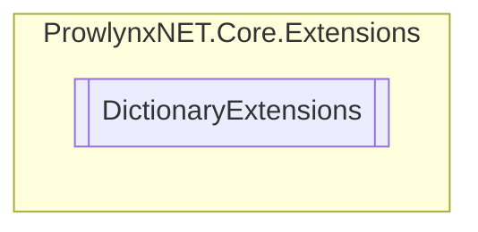

# DictionaryExtensions `Public class`

## Description
A collection of extensions for dictionaries.

## Diagram


## Members
### Methods
#### Public Static methods
| Returns | Name |
| --- | --- |
| `Dictionary`&lt;`TKey`, `TValue`&gt; | [`AddOrUpdate`](#addorupdate)(`Dictionary`&lt;`TKey`, `TValue`&gt; current, `Dictionary`&lt;`TKey`, `TValue`&gt; additional) |

## Details
### Summary
A collection of extensions for dictionaries.

### Methods
#### AddOrUpdate
[*Source code*](https://github.com///blob//ProwlynxNET.Core/Extensions/DictionaryExtensions.cs#L26)
```csharp
public static Dictionary<TKey, TValue> AddOrUpdate<TKey, TValue>(Dictionary<TKey, TValue> current, Dictionary<TKey, TValue> additional)
where TKey : 
where TValue : 
```
##### Arguments
| Type | Name | Description |
| --- | --- | --- |
| `Dictionary`&lt;`TKey`, `TValue`&gt; | current |   |
| `Dictionary`&lt;`TKey`, `TValue`&gt; | additional |   |

*Generated with* [*ModularDoc*](https://github.com/hailstorm75/ModularDoc)
