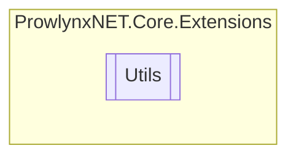

# Utils `Public class`

## Description
Provides a set of utility methods

## Diagram


## Members
### Methods
#### Public Static methods
| Returns | Name |
| --- | --- |
| `void` | [`AddListEntry`](#addlistentry)(`IDictionary`&lt;`TKey`, `List`&lt;`TValue`&gt;&gt; self, `TKey` key, `TValue` value) |
| `string` | [`EncodeString`](#encodestring)(`byte``[]` buff, `char``[]` charset)<br>Encoding the buffer to a string using specified charset. |
| `string` | [`GetRelativePath`](#getrelativepath)(`string` filespec, `string` folder)<br>Obtains the relative path from the specified base path. |
| `TValue` | [`GetValueOrDefault`](#getvalueordefault)(`Dictionary`&lt;`TKey`, `TValue`&gt; dictionary, `TKey` key, `TValue` defValue) |
| `TValue` | [`GetValueOrDefaultLazy`](#getvalueordefaultlazy)(`Dictionary`&lt;`TKey`, `TValue`&gt; dictionary, `TKey` key, `Func`&lt;`TKey`, `TValue`&gt; defValueFactory) |
| `string` | [`NullIfEmpty`](#nullifempty)(`string` val)<br>If the input string is empty, return null; otherwise, return the original input string. |
| `IList`&lt;`T`&gt; | [`RemoveWhere`](#removewhere)(`IList`&lt;`T`&gt; self, `Predicate`&lt;`T`&gt; match) |
| `string` | [`Replace`](#replace)(`string` str, `string` oldValue, `string` newValue, `StringComparison` comparison)<br>Returns a new string in which all occurrences of a specified string in `str` `str` are replaced with another specified string. |
| `byte``[]` | [`SHA1`](#sha1)(`byte``[]` buffer)<br>Compute the SHA1 hash of the input buffer. |
| `byte``[]` | [`SHA256`](#sha256)(`byte``[]` buffer)<br>Compute the SHA256 hash of the input buffer. |
| `string` | [`ToHexString`](#tohexstring)(`byte``[]` buff)<br>Encode the buffer to a hexadecimal string. |
| `byte``[]` | [`Xor`](#xor)(`byte``[]` buffer1, `byte``[]` buffer2)<br>Xor the values in the two buffer together. |

## Details
### Summary
Provides a set of utility methods

### Methods
#### GetValueOrDefault
[*Source code*](https://github.com///blob//ProwlynxNET.Core/Extensions/Utils.cs#L30)
```csharp
public static TValue GetValueOrDefault<TKey, TValue>(Dictionary<TKey, TValue> dictionary, TKey key, TValue defValue)
where TKey : 
where TValue : 
```
##### Arguments
| Type | Name | Description |
| --- | --- | --- |
| `Dictionary`&lt;`TKey`, `TValue`&gt; | dictionary |   |
| `TKey` | key |   |
| `TValue` | defValue |   |

#### GetValueOrDefaultLazy
[*Source code*](https://github.com///blob//ProwlynxNET.Core/Extensions/Utils.cs#L50)
```csharp
public static TValue GetValueOrDefaultLazy<TKey, TValue>(Dictionary<TKey, TValue> dictionary, TKey key, Func<TKey, TValue> defValueFactory)
where TKey : 
where TValue : 
```
##### Arguments
| Type | Name | Description |
| --- | --- | --- |
| `Dictionary`&lt;`TKey`, `TValue`&gt; | dictionary |   |
| `TKey` | key |   |
| `Func`&lt;`TKey`, `TValue`&gt; | defValueFactory |   |

#### AddListEntry
[*Source code*](https://github.com///blob//ProwlynxNET.Core/Extensions/Utils.cs#L67)
```csharp
public static void AddListEntry<TKey, TValue>(IDictionary<TKey, List<TValue>> self, TKey key, TValue value)
where TKey : 
where TValue : 
```
##### Arguments
| Type | Name | Description |
| --- | --- | --- |
| `IDictionary`&lt;`TKey`, `List`&lt;`TValue`&gt;&gt; | self |   |
| `TKey` | key |   |
| `TValue` | value |   |

#### GetRelativePath
[*Source code*](https://github.com///blob//ProwlynxNET.Core/Extensions/Utils.cs#L83)
```csharp
public static string GetRelativePath(string filespec, string folder)
```
##### Arguments
| Type | Name | Description |
| --- | --- | --- |
| `string` | filespec | The file path. |
| `string` | folder | The base path. |

##### Summary
Obtains the relative path from the specified base path.

##### Returns
The path of `filespec` relative to `folder` .

#### NullIfEmpty
[*Source code*](https://github.com///blob//ProwlynxNET.Core/Extensions/Utils.cs#L102)
```csharp
public static string NullIfEmpty(string val)
```
##### Arguments
| Type | Name | Description |
| --- | --- | --- |
| `string` | val | The input string. |

##### Summary
If the input string is empty, return null; otherwise, return the original input string.

##### Returns
`null` if the input string is empty; otherwise, the original input string.

#### SHA1
[*Source code*](https://github.com///blob//ProwlynxNET.Core/Extensions/Utils.cs#L114)
```csharp
public static byte SHA1(byte[] buffer)
```
##### Arguments
| Type | Name | Description |
| --- | --- | --- |
| `byte``[]` | buffer | The input buffer. |

##### Summary
Compute the SHA1 hash of the input buffer.

##### Returns
The SHA1 hash of the input buffer.

#### Xor
[*Source code*](https://github.com///blob//ProwlynxNET.Core/Extensions/Utils.cs#L127)
```csharp
public static byte Xor(byte[] buffer1, byte[] buffer2)
```
##### Arguments
| Type | Name | Description |
| --- | --- | --- |
| `byte``[]` | buffer1 | The input buffer 1. |
| `byte``[]` | buffer2 | The input buffer 2. |

##### Summary
Xor the values in the two buffer together.

##### Returns
The result buffer.

##### Exceptions
| Name | Description |
| --- | --- |
| ArgumentException | Length of the two buffers are not equal. |

#### SHA256
[*Source code*](https://github.com///blob//ProwlynxNET.Core/Extensions/Utils.cs#L142)
```csharp
public static byte SHA256(byte[] buffer)
```
##### Arguments
| Type | Name | Description |
| --- | --- | --- |
| `byte``[]` | buffer | The input buffer. |

##### Summary
Compute the SHA256 hash of the input buffer.

##### Returns
The SHA256 hash of the input buffer.

#### EncodeString
[*Source code*](https://github.com///blob//ProwlynxNET.Core/Extensions/Utils.cs#L154)
```csharp
public static string EncodeString(byte[] buff, char[] charset)
```
##### Arguments
| Type | Name | Description |
| --- | --- | --- |
| `byte``[]` | buff | The input buffer. |
| `char``[]` | charset | The charset. |

##### Summary
Encoding the buffer to a string using specified charset.

##### Returns
The encoded string.

#### Replace
[*Source code*](https://github.com///blob//ProwlynxNET.Core/Extensions/Utils.cs#L186)
```csharp
public static string Replace(string str, string oldValue, string newValue, StringComparison comparison)
```
##### Arguments
| Type | Name | Description |
| --- | --- | --- |
| `string` | str | A string to do the replace in. |
| `string` | oldValue | A string to be replaced. |
| `string` | newValue | A string to replace all occurrences of `oldValue` . |
| `StringComparison` | comparison | One of the StringComparison values. |

##### Summary
Returns a new string in which all occurrences of a specified string in `str` `str` are replaced with another specified string.

##### Remarks
Adopted from http://stackoverflow.com/a/244933

##### Returns
A String equivalent to `str` but with all instances of `oldValue` replaced with `newValue` .

#### ToHexString
[*Source code*](https://github.com///blob//ProwlynxNET.Core/Extensions/Utils.cs#L211)
```csharp
public static string ToHexString(byte[] buff)
```
##### Arguments
| Type | Name | Description |
| --- | --- | --- |
| `byte``[]` | buff | The input buffer. |

##### Summary
Encode the buffer to a hexadecimal string.

##### Returns
A hexadecimal representation of input buffer.

#### RemoveWhere
[*Source code*](https://github.com///blob//ProwlynxNET.Core/Extensions/Utils.cs#L230)
```csharp
public static IList<T> RemoveWhere<T>(IList<T> self, Predicate<T> match)
where T : 
```
##### Arguments
| Type | Name | Description |
| --- | --- | --- |
| `IList`&lt;`T`&gt; | self |   |
| `Predicate`&lt;`T`&gt; | match |   |

*Generated with* [*ModularDoc*](https://github.com/hailstorm75/ModularDoc)
