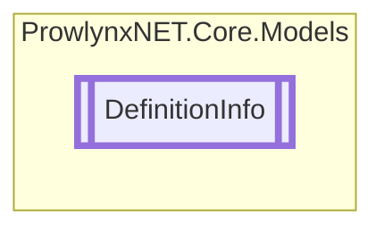

# DefinitionInfo `Public class`

## Description
A class that provides helpful properties for the underlying [DefinitionInfo](prowlynxnet/core/models/DefinitionInfo.md).[Def](#def) .

## Diagram


## Members
### Properties
#### Public  properties
| Type | Name | Methods |
| --- | --- | --- |
| `IMemberDefinition` | [`Def`](#def)<br>The definition (property, method, type, etc.) | `get, set` |
| `EventDefinition` | [`EventDef`](#eventdef)<br>The event definition (or null). | `get` |
| `bool` | [`HasDef`](#hasdef)<br>Whether the obfuscation info has a definition attached. | `get` |
| `bool` | [`IsEventDef`](#iseventdef)<br>Whether the [DefinitionInfo](prowlynxnet/core/models/DefinitionInfo.md).[Def](#def) is a event definition. | `get` |
| `bool` | [`IsFieldDef`](#isfielddef)<br>Whether the [DefinitionInfo](prowlynxnet/core/models/DefinitionInfo.md).[Def](#def) is a field definition. | `get` |
| `bool` | [`IsMethodDef`](#ismethoddef)<br>Whether the [DefinitionInfo](prowlynxnet/core/models/DefinitionInfo.md).[Def](#def) is a method definition. | `get` |
| `bool` | [`IsPropertyDef`](#ispropertydef)<br>Whether the [DefinitionInfo](prowlynxnet/core/models/DefinitionInfo.md).[Def](#def) is a property definition. | `get` |
| `bool` | [`IsTypeDef`](#istypedef)<br>Whether the [DefinitionInfo](prowlynxnet/core/models/DefinitionInfo.md).[Def](#def) is a type definition. | `get` |
| `MethodDefinition` | [`MethodDef`](#methoddef)<br>The method definition (or null). | `get` |
| `PropertyDefinition` | [`PropertyDef`](#propertydef)<br>The property definition (or null). | `get` |
| `TypeDefinition` | [`TypeDef`](#typedef)<br>The type definition (or null). | `get` |

## Details
### Summary
A class that provides helpful properties for the underlying [DefinitionInfo](prowlynxnet/core/models/DefinitionInfo.md).[Def](#def) .

### Constructors
#### DefinitionInfo
```csharp
protected DefinitionInfo()
```

### Properties
#### HasDef
```csharp
public bool HasDef { get; }
```
##### Summary
Whether the obfuscation info has a definition attached.

#### IsMethodDef
```csharp
public bool IsMethodDef { get; }
```
##### Summary
Whether the [DefinitionInfo](prowlynxnet/core/models/DefinitionInfo.md).[Def](#def) is a method definition.

#### IsFieldDef
```csharp
public bool IsFieldDef { get; }
```
##### Summary
Whether the [DefinitionInfo](prowlynxnet/core/models/DefinitionInfo.md).[Def](#def) is a field definition.

#### IsTypeDef
```csharp
public bool IsTypeDef { get; }
```
##### Summary
Whether the [DefinitionInfo](prowlynxnet/core/models/DefinitionInfo.md).[Def](#def) is a type definition.

#### IsEventDef
```csharp
public bool IsEventDef { get; }
```
##### Summary
Whether the [DefinitionInfo](prowlynxnet/core/models/DefinitionInfo.md).[Def](#def) is a event definition.

#### IsPropertyDef
```csharp
public bool IsPropertyDef { get; }
```
##### Summary
Whether the [DefinitionInfo](prowlynxnet/core/models/DefinitionInfo.md).[Def](#def) is a property definition.

#### TypeDef
```csharp
public TypeDefinition TypeDef { get; }
```
##### Summary
The type definition (or null).

#### MethodDef
```csharp
public MethodDefinition MethodDef { get; }
```
##### Summary
The method definition (or null).

#### EventDef
```csharp
public EventDefinition EventDef { get; }
```
##### Summary
The event definition (or null).

#### PropertyDef
```csharp
public PropertyDefinition PropertyDef { get; }
```
##### Summary
The property definition (or null).

#### Def
```csharp
public IMemberDefinition Def { get; set; }
```
##### Summary
The definition (property, method, type, etc.)

*Generated with* [*ModularDoc*](https://github.com/hailstorm75/ModularDoc)
