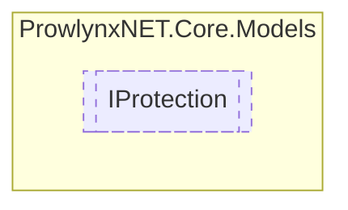

# IProtection `Public interface`

## Description
A protection for the obfuscator, it has stages that modify the contents of the module.

## Diagram


## Members
### Properties
#### Public  properties
| Type | Name | Methods |
| --- | --- | --- |
| `string` | [`ProtectionName`](#protectionname)<br>The name of the protection. | `get, set` |
| `int` | [`ProtectionPriority`](#protectionpriority)<br>The priority for this protection. A lower number is a higher priority. | `get, set` |
| `List`&lt;[`IProtectionStage`](./IProtectionStage.md)&gt; | [`Stages`](#stages)<br>The stages that operate on the module. | `get, set` |

### Methods
#### Public  methods
| Returns | Name |
| --- | --- |
| `T` | [`GetStage`](#getstage)() |
| `List`&lt;`T`&gt; | [`GetStages`](#getstages)() |

## Details
### Summary
A protection for the obfuscator, it has stages that modify the contents of the module.

### Methods
#### GetStages
```csharp
public List<T> GetStages<T>()
where T : IProtectionStage
```

#### GetStage
```csharp
public T GetStage<T>()
where T : IProtectionStage
```

### Properties
#### ProtectionName
```csharp
public string ProtectionName { get; set; }
```
##### Summary
The name of the protection.

#### Stages
```csharp
public List<IProtectionStage> Stages { get; set; }
```
##### Summary
The stages that operate on the module.

#### ProtectionPriority
```csharp
public int ProtectionPriority { get; set; }
```
##### Summary
The priority for this protection. A lower number is a higher priority.

*Generated with* [*ModularDoc*](https://github.com/hailstorm75/ModularDoc)
