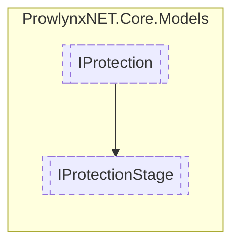

# IProtectionStage `Public interface`

## Description
A protection stage that is a part of a protection.
                Protection stages can also have sub-stages so protection stage inherits from [IProtection](./IProtection.md)

## Diagram


## Members
### Properties
#### Public  properties
| Type | Name | Methods |
| --- | --- | --- |
| [`IProtection`](./IProtection.md) | [`ParentProtection`](#parentprotection)<br>The protection that is directly the owner of the stage. | `get, set` |
| `int` | [`StagePriority`](#stagepriority)<br>The priority for the stage. A lower number is a higher priority. | `get, set` |

## Details
### Summary
A protection stage that is a part of a protection.
                Protection stages can also have sub-stages so protection stage inherits from [IProtection](./IProtection.md)

### Inheritance
 - [
`IProtection`
](./IProtection.md)

### Properties
#### StagePriority
```csharp
public int StagePriority { get; set; }
```
##### Summary
The priority for the stage. A lower number is a higher priority.

#### ParentProtection
```csharp
public IProtection ParentProtection { get; set; }
```
##### Summary
The protection that is directly the owner of the stage.

*Generated with* [*ModularDoc*](https://github.com/hailstorm75/ModularDoc)
