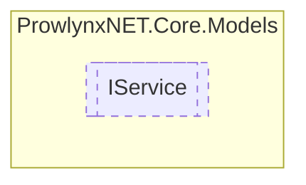

# IService `Public interface`

## Description
A service that a IServiceProvider provides.

## Diagram


## Members
### Properties
#### Public  properties
| Type | Name | Methods |
| --- | --- | --- |
| `string` | [`Description`](#description)<br>Description of the service. | `get` |
| `string` | [`Name`](#name)<br>The unique name of the service. | `get` |

## Details
### Summary
A service that a IServiceProvider provides.

### Properties
#### Name
```csharp
public string Name { get; }
```
##### Summary
The unique name of the service.

#### Description
```csharp
public string Description { get; }
```
##### Summary
Description of the service.

*Generated with* [*ModularDoc*](https://github.com/hailstorm75/ModularDoc)
