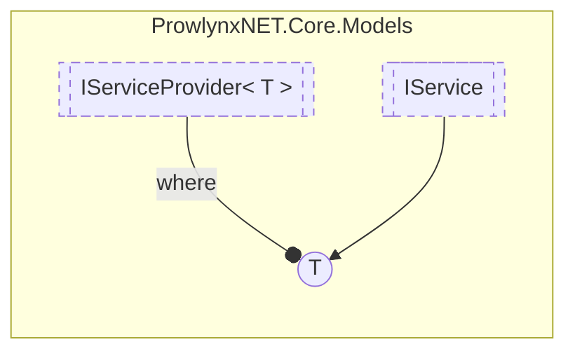

# IServiceProvider&lt; T&gt; `Public interface`

## Description
Provides a series of [IService](./IService.md) .

## Diagram


## Members
### Properties
#### Public  properties
| Type | Name | Methods |
| --- | --- | --- |
| `List`&lt;`T`&gt; | [`Services`](#services)<br>The list of services the provider supplies | `get` |

### Methods
#### Public  methods
| Returns | Name |
| --- | --- |
| `void` | [`AddService`](#addservice)(`T` service) |
| `T` | [`GetService`](#getservice)(`string` serviceName)<br>Get a particular [IService](./IService.md) with the unique service name. |

## Details
### Summary
Provides a series of [IService](./IService.md) .

### Methods
#### GetService
```csharp
public T GetService(string serviceName)
```
##### Arguments
| Type | Name | Description |
| --- | --- | --- |
| `string` | serviceName | The service name |

##### Summary
Get a particular [IService](./IService.md) with the unique service name.

##### Returns
The related service, or null

#### AddService
```csharp
public void AddService(T service)
```
##### Arguments
| Type | Name | Description |
| --- | --- | --- |
| `T` | service |   |

### Properties
#### Services
```csharp
public List<T> Services { get; }
```
##### Summary
The list of services the provider supplies

*Generated with* [*ModularDoc*](https://github.com/hailstorm75/ModularDoc)
