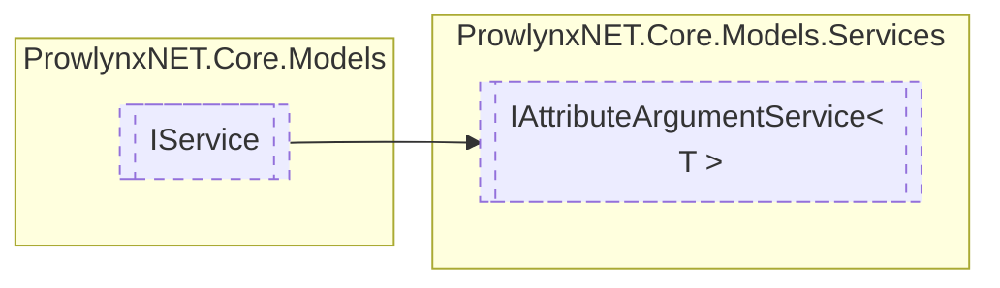

# IAttributeArgumentService&lt; T&gt; `Public interface`

## Description
A service that handles arguments passed to protections via an attribute on a definition.

## Diagram


## Members
### Properties
#### Public  properties
| Type | Name | Methods |
| --- | --- | --- |
| `List`&lt;`T`&gt; | [`Database`](#database)<br>A database storing [ArgumentInfo](../../services/argument/ArgumentInfo.md) s for the service. | `get` |

### Methods
#### Public  methods
| Returns | Name |
| --- | --- |
| `void` | [`Add`](#add-12)(`...`)<br>Add or update an argument for a specific definition for a protection. |
| `bool` | [`Exists`](#exists)(`IMemberDefinition` definition, `string` protectionName)<br>Check whether an entry exists for a definition for the specified protection. |
| [`ArgumentDictionary`](../../services/argument/ArgumentDictionary.md) | [`GetArguments`](#getarguments)([`IProtection`](../IProtection.md) protection, `IMemberDefinition` definition)<br>Get arguments that originated from an attribute for a specific protection that are applied to a specific<br>                definition. |

## Details
### Summary
A service that handles arguments passed to protections via an attribute on a definition.

### Inheritance
 - [
`IService`
](../IService.md)

### Methods
#### Add [1/2]
```csharp
public void Add(IMemberDefinition definition, string protectionName, string name, string value, bool applyToMembers)
```
##### Arguments
| Type | Name | Description |
| --- | --- | --- |
| `IMemberDefinition` | definition | The definition. |
| `string` | protectionName | The [IProtection](../IProtection.md) name. |
| `string` | name | The name (key) of the argument. |
| `string` | value | The value of the argument. |
| `bool` | applyToMembers | Whether to apply the argument to descending members. |

##### Summary
Add or update an argument for a specific definition for a protection.

#### Add [2/2]
```csharp
public void Add(ArgumentInfo info)
```
##### Arguments
| Type | Name | Description |
| --- | --- | --- |
| [`ArgumentInfo`](../../services/argument/ArgumentInfo.md) | info | The argument to add or update the existing. |

##### Summary
Add or update an argument from a given argument.

#### Exists
```csharp
public bool Exists(IMemberDefinition definition, string protectionName)
```
##### Arguments
| Type | Name | Description |
| --- | --- | --- |
| `IMemberDefinition` | definition | The definition. |
| `string` | protectionName | The [IProtection](../IProtection.md) name. |

##### Summary
Check whether an entry exists for a definition for the specified protection.

##### Returns
Whether an entry exists.

#### GetArguments
```csharp
public ArgumentDictionary GetArguments(IProtection protection, IMemberDefinition definition)
```
##### Arguments
| Type | Name | Description |
| --- | --- | --- |
| [`IProtection`](../IProtection.md) | protection | The protection. |
| `IMemberDefinition` | definition | The definition. |

##### Summary
Get arguments that originated from an attribute for a specific protection that are applied to a specific
                definition.

##### Returns
The list of arguments.

### Properties
#### Database
```csharp
public List<T> Database { get; }
```
##### Summary
A database storing [ArgumentInfo](../../services/argument/ArgumentInfo.md) s for the service.

*Generated with* [*ModularDoc*](https://github.com/hailstorm75/ModularDoc)
