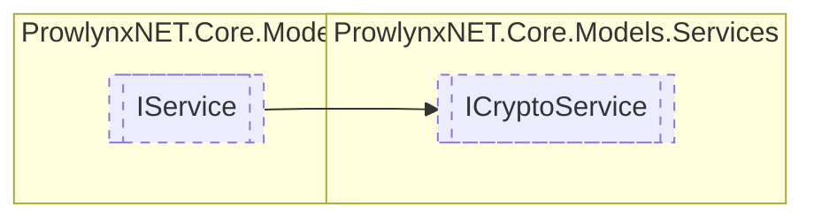

# ICryptoService `Public interface`

## Description
A generic cryptography service.

## Diagram


## Members
### Properties
#### Public  properties
| Type | Name | Methods |
| --- | --- | --- |
| `byte``[]` | [`AdditionalData`](#additionaldata)<br>Sometimes an algorithm may require additional data, an IV for example. | `get, set` |
| `byte``[]` | [`Key`](#key)<br>The key for the cryptography operation | `get, set` |

### Methods
#### Public  methods
| Returns | Name |
| --- | --- |
| `byte``[]` | [`Decrypt`](#decrypt)(`byte``[]` data)<br>Decrypt a byte array. The data to decrypt (already encrypted) |
| `byte``[]` | [`Encrypt`](#encrypt)(`byte``[]` data)<br>Encrypt a byte array The data to encrypt |

## Details
### Summary
A generic cryptography service.

### Inheritance
 - [
`IService`
](../IService.md)

### Methods
#### Encrypt
```csharp
public byte Encrypt(byte[] data)
```
##### Arguments
| Type | Name | Description |
| --- | --- | --- |
| `byte``[]` | data |   |

##### Summary
Encrypt a byte array The data to encrypt

##### Returns
The encrypted byte array

#### Decrypt
```csharp
public byte Decrypt(byte[] data)
```
##### Arguments
| Type | Name | Description |
| --- | --- | --- |
| `byte``[]` | data |   |

##### Summary
Decrypt a byte array. The data to decrypt (already encrypted)

##### Returns
The decrypted byte array

### Properties
#### Key
```csharp
public byte Key { get; set; }
```
##### Summary
The key for the cryptography operation

#### AdditionalData
```csharp
public byte AdditionalData { get; set; }
```
##### Summary
Sometimes an algorithm may require additional data, an IV for example.

*Generated with* [*ModularDoc*](https://github.com/hailstorm75/ModularDoc)
