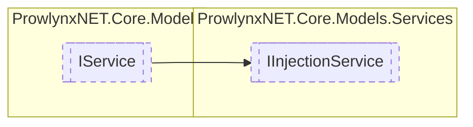

# IInjectionService `Public interface`

## Description
A service that provides the ability to copy types and methods into another module.

## Diagram


## Members
### Methods
#### Public  methods
| Returns | Name |
| --- | --- |
| `IList`&lt;`TypeDefinition`&gt; | [`Inject`](#inject-13)(`...`)<br>Injects the specified Module to another module.<br>                Does NOT add the result to the module. |

## Details
### Summary
A service that provides the ability to copy types and methods into another module.

### Inheritance
 - [
`IService`
](../IService.md)

### Methods
#### Inject [1/3]
```csharp
public IList<TypeDefinition> Inject(ModuleDefinition injectModule, ModuleDefinition target)
```
##### Arguments
| Type | Name | Description |
| --- | --- | --- |
| `ModuleDefinition` | injectModule | The source ModuleDefMD. |
| `ModuleDefinition` | target | The target module. |

##### Summary
Injects the specified Module to another module.
                Does NOT add the result to the module.

#### Inject [2/3]
```csharp
public T Inject<T>(T def, ModuleDefinition target)
where T : IMemberDefinition
```
##### Arguments
| Type | Name | Description |
| --- | --- | --- |
| `T` | def |   |
| `ModuleDefinition` | target |   |

#### Inject [3/3]
```csharp
public IList<T> Inject<T>(IEnumerable<T> def, ModuleDefinition target)
where T : IMemberDefinition
```
##### Arguments
| Type | Name | Description |
| --- | --- | --- |
| `IEnumerable`&lt;`T`&gt; | def |   |
| `ModuleDefinition` | target |   |

*Generated with* [*ModularDoc*](https://github.com/hailstorm75/ModularDoc)
