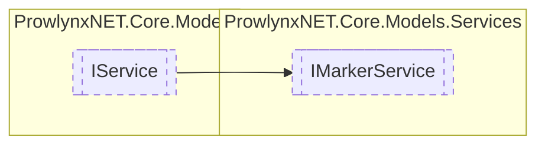

# IMarkerService `Public interface`

## Description
The marker service contains the marker information and handles adding markings and checking if markings exist.

## Diagram


## Members
### Properties
#### Public  properties
| Type | Name | Methods |
| --- | --- | --- |
| [`MarkerInfo`](../../services/marker/MarkerInfo.md) | [`Database`](#database)<br>The database of marker information for the marker service. | `get` |

### Methods
#### Public  methods
| Returns | Name |
| --- | --- |
| `void` | [`AddMark`](#addmark-12)(`...`)<br>Add an obfuscation info to the marker database. |
| `bool` | [`CanProtect`](#canprotect-14)(`...`)<br>Check whether the protection can protect the type. |

## Details
### Summary
The marker service contains the marker information and handles adding markings and checking if markings exist.

### Inheritance
 - [
`IService`
](../IService.md)

### Methods
#### AddMark [1/2]
```csharp
public void AddMark(ObfuscationInfo info)
```
##### Arguments
| Type | Name | Description |
| --- | --- | --- |
| [`ObfuscationInfo`](../../services/marker/ObfuscationInfo.md) | info | The obfuscation info. Cannot be null. |

##### Summary
Add an obfuscation info to the marker database.

#### AddMark [2/2]
```csharp
public void AddMark(IMemberDefinition target, string protectionName, bool exclude, bool applyToMembers)
```
##### Arguments
| Type | Name | Description |
| --- | --- | --- |
| `IMemberDefinition` | target | The target definition. |
| `string` | protectionName | The protection name from the calling [IProtection](../IProtection.md) . |
| `bool` | exclude | Whether to disallow protection. |
| `bool` | applyToMembers | Whether to apply the same mark to methods. |

##### Summary
Add a mark for the given arguments.

#### CanProtect [1/4]
```csharp
public bool CanProtect(IProtection currentProtection, TypeDefinition targetType, bool checkForPropagation)
```
##### Arguments
| Type | Name | Description |
| --- | --- | --- |
| [`IProtection`](../IProtection.md) | currentProtection | The protection currently running. |
| `TypeDefinition` | targetType | The target type to protect. |
| `bool` | checkForPropagation | Used internally for recursion. Whether to check that the types apply to members. |

##### Summary
Check whether the protection can protect the type.

##### Returns
Whether the protection can protect the target type.

#### CanProtect [2/4]
```csharp
public bool CanProtect(IProtection currentProtection, MethodDefinition targetMethod)
```
##### Arguments
| Type | Name | Description |
| --- | --- | --- |
| [`IProtection`](../IProtection.md) | currentProtection | The protection currently running. |
| `MethodDefinition` | targetMethod | The method that is to be protected. |

##### Summary
Check whether the protection can protect a given method.

##### Returns
Whether the protection can protect the target method.

#### CanProtect [3/4]
```csharp
public bool CanProtect(IProtection currentProtection, EventDefinition targetEvent)
```
##### Arguments
| Type | Name | Description |
| --- | --- | --- |
| [`IProtection`](../IProtection.md) | currentProtection | The protection currently running. |
| `EventDefinition` | targetEvent | The event that is to be protected. |

##### Summary
Check whether the protection can protect a given event.

##### Returns
Whether the protection can protect the target event.

#### CanProtect [4/4]
```csharp
public bool CanProtect(IProtection currentProtection, PropertyDefinition targetProperty)
```
##### Arguments
| Type | Name | Description |
| --- | --- | --- |
| [`IProtection`](../IProtection.md) | currentProtection | The protection currently running. |
| `PropertyDefinition` | targetProperty | The property that is to be protected. |

##### Summary
Check whether the protection can protect a given property.

##### Returns
Whether the protection can protect the target property.

### Properties
#### Database
```csharp
public MarkerInfo Database { get; }
```
##### Summary
The database of marker information for the marker service.

*Generated with* [*ModularDoc*](https://github.com/hailstorm75/ModularDoc)
