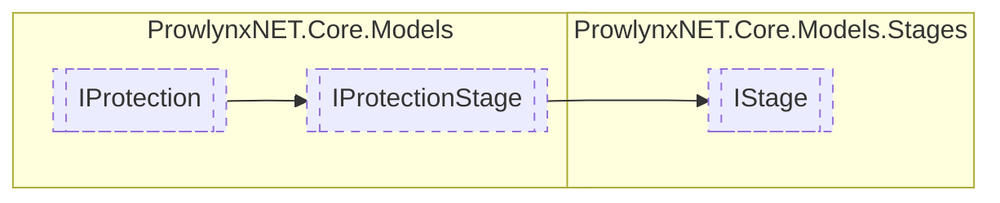

# IStage `Public interface`

## Description
A protection stage that does not relate to writing. Most protections will have at least one of this stage type.

## Diagram


## Members
### Methods
#### Public  methods
| Returns | Name |
| --- | --- |
| `void` | [`Process`](#process)([`ObfuscationTask`](../../ObfuscationTask.md) t)<br>Process the stage. |

## Details
### Summary
A protection stage that does not relate to writing. Most protections will have at least one of this stage type.

### Inheritance
 - [
`IProtectionStage`
](../IProtectionStage.md)
 - [
`IProtection`
](../IProtection.md)

### Methods
#### Process
```csharp
public void Process(ObfuscationTask t)
```
##### Arguments
| Type | Name | Description |
| --- | --- | --- |
| [`ObfuscationTask`](../../ObfuscationTask.md) | t | The obfuscation task currently being processed |

##### Summary
Process the stage.

*Generated with* [*ModularDoc*](https://github.com/hailstorm75/ModularDoc)
