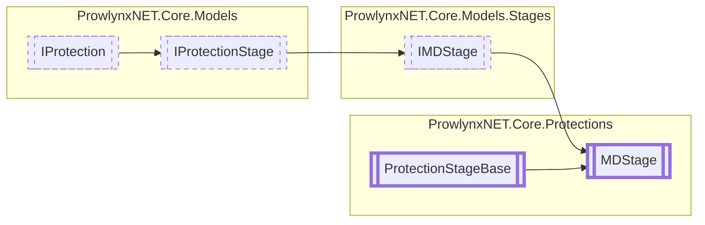

# MDStage `Public class`

## Description
Base of all stages that change metadata or a PEImage being written.

## Diagram


## Members
### Methods
#### Public  methods
| Returns | Name |
| --- | --- |
| `void` | [`Process`](#process)([`ObfuscationTask`](../ObfuscationTask.md) t, `IPEImage` peImage)<br>Process the stage. |

## Details
### Summary
Base of all stages that change metadata or a PEImage being written.

### Inheritance
 - [
`IMDStage`
](../models/stages/IMDStage.md)
 - [
`IProtectionStage`
](../models/IProtectionStage.md)
 - [
`IProtection`
](../models/IProtection.md)
 - [
`ProtectionStageBase`
](./ProtectionStageBase.md)

### Constructors
#### MDStage
[*Source code*](https://github.com///blob//ProwlynxNET.Core/Protections/MDStage.cs#L25)
```csharp
protected MDStage(IProtection parentProtection)
```
##### Arguments
| Type | Name | Description |
| --- | --- | --- |
| [`IProtection`](../models/IProtection.md) | parentProtection | The parent protection. |

##### Summary
Create a new [MDStage](prowlynxnet/core/protections/MDStage.md) owned by the specified protection.

### Methods
#### Process
```csharp
public abstract void Process(ObfuscationTask t, IPEImage peImage)
```
##### Arguments
| Type | Name | Description |
| --- | --- | --- |
| [`ObfuscationTask`](../ObfuscationTask.md) | t | The task, noting that Module is inaccessible (null). |
| `IPEImage` | peImage | The PE Image with DotNetDirectory. |

##### Summary
Process the stage.

*Generated with* [*ModularDoc*](https://github.com/hailstorm75/ModularDoc)
