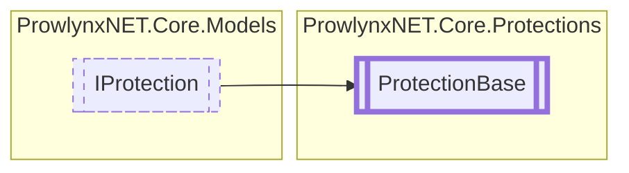

# ProtectionBase `Public class`

## Description
Base of all protections.

## Diagram


## Members
### Properties
#### Public  properties
| Type | Name | Methods |
| --- | --- | --- |
| `bool` | [`HasStages`](#hasstages)<br>Whether the protection or stage has stages. | `get` |
| `string` | [`ProtectionName`](#protectionname)<br>The name of the protection. | `get, set` |
| `int` | [`ProtectionPriority`](#protectionpriority)<br>The priority for this protection. A lower number is a higher priority. | `get, set` |
| `List`&lt;[`IProtectionStage`](../models/IProtectionStage.md)&gt; | [`Stages`](#stages)<br>The stages that operate on the module. | `get, set` |

### Methods
#### Public  methods
| Returns | Name |
| --- | --- |
| `T` | [`GetStage`](#getstage)() |
| `List`&lt;`T`&gt; | [`GetStages`](#getstages)() |

## Details
### Summary
Base of all protections.

### Inheritance
 - [
`IProtection`
](../models/IProtection.md)

### Constructors
#### ProtectionBase
[*Source code*](https://github.com///blob//ProwlynxNET.Core/Protections/ProtectionBase.cs#L51)
```csharp
protected ProtectionBase()
```

### Methods
#### GetStages
[*Source code*](https://github.com///blob//ProwlynxNET.Core/Protections/ProtectionBase.cs#L59)
```csharp
public virtual List<T> GetStages<T>()
where T : IProtectionStage
```

#### GetStage
[*Source code*](https://github.com///blob//ProwlynxNET.Core/Protections/ProtectionBase.cs#L65)
```csharp
public virtual T GetStage<T>()
where T : IProtectionStage
```

### Properties
#### ProtectionName
```csharp
public abstract string ProtectionName { get; set; }
```
##### Summary
The name of the protection.

#### HasStages
```csharp
public bool HasStages { get; }
```
##### Summary
Whether the protection or stage has stages.

#### Stages
```csharp
public virtual List<IProtectionStage> Stages { get; set; }
```
##### Summary
The stages that operate on the module.

#### ProtectionPriority
```csharp
public abstract int ProtectionPriority { get; set; }
```
##### Summary
The priority for this protection. A lower number is a higher priority.

*Generated with* [*ModularDoc*](https://github.com/hailstorm75/ModularDoc)
