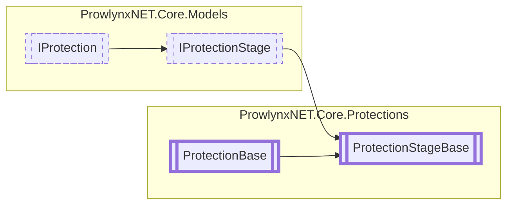

# ProtectionStageBase `Public class`

## Description
Should not be directly inherited by a protection. Use the [Stage](./Stage.md) or [MDStage](./MDStage.md) classes.

## Diagram


## Members
### Properties
#### Public  properties
| Type | Name | Methods |
| --- | --- | --- |
| [`IProtection`](../models/IProtection.md) | [`ParentProtection`](#parentprotection)<br>The protection that is directly the owner of the stage. | `get, set` |
| `string` | [`ProtectionName`](#protectionname)<br>The name of the protection. | `get, set` |
| `int` | [`ProtectionPriority`](#protectionpriority)<br>The priority for this protection. A lower number is a higher priority. | `get, set` |
| `int` | [`StagePriority`](#stagepriority)<br>The priority for the stage. A lower number is a higher priority. | `get, set` |

## Details
### Summary
Should not be directly inherited by a protection. Use the [Stage](./Stage.md) or [MDStage](./MDStage.md) classes.

### Inheritance
 - [
`IProtectionStage`
](../models/IProtectionStage.md)
 - [
`IProtection`
](../models/IProtection.md)
 - [
`ProtectionBase`
](./ProtectionBase.md)

### Constructors
#### ProtectionStageBase
[*Source code*](https://github.com///blob//ProwlynxNET.Core/Protections/ProtectionStageBase.cs#L28)
```csharp
protected ProtectionStageBase(IProtection parentProtection)
```
##### Arguments
| Type | Name | Description |
| --- | --- | --- |
| [`IProtection`](../models/IProtection.md) | parentProtection | The parent protection. |

##### Summary
Create a new [ProtectionStageBase](prowlynxnet/core/protections/ProtectionStageBase.md) owned by the specified protection.
                Copying the protection name from the supplied protection.

### Properties
#### StagePriority
```csharp
public abstract int StagePriority { get; set; }
```
##### Summary
The priority for the stage. A lower number is a higher priority.

#### ParentProtection
```csharp
public virtual IProtection ParentProtection { get; set; }
```
##### Summary
The protection that is directly the owner of the stage.

#### ProtectionPriority
```csharp
public override int ProtectionPriority { get; set; }
```
##### Summary
The priority for this protection. A lower number is a higher priority.

#### ProtectionName
```csharp
public override string ProtectionName { get; set; }
```
##### Summary
The name of the protection.

*Generated with* [*ModularDoc*](https://github.com/hailstorm75/ModularDoc)
