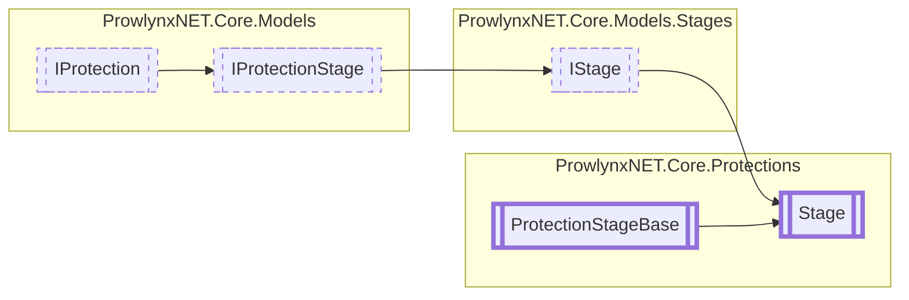

# Stage `Public class`

## Description
Base of all regular stages that modify methods/modules/etc before writing beings.

## Diagram


## Members
### Methods
#### Public  methods
| Returns | Name |
| --- | --- |
| `void` | [`Process`](#process)([`ObfuscationTask`](../ObfuscationTask.md) t)<br>Process the stage. |

## Details
### Summary
Base of all regular stages that modify methods/modules/etc before writing beings.

### Inheritance
 - [
`IStage`
](../models/stages/IStage.md)
 - [
`IProtectionStage`
](../models/IProtectionStage.md)
 - [
`IProtection`
](../models/IProtection.md)
 - [
`ProtectionStageBase`
](./ProtectionStageBase.md)

### Constructors
#### Stage
[*Source code*](https://github.com///blob//ProwlynxNET.Core/Protections/Stage.cs#L23)
```csharp
protected Stage(IProtection parentProtection)
```
##### Arguments
| Type | Name | Description |
| --- | --- | --- |
| [`IProtection`](../models/IProtection.md) | parentProtection | The parent protection. |

##### Summary
Create a new [Stage](prowlynxnet/core/protections/Stage.md) owned by the specified protection.

### Methods
#### Process
```csharp
public abstract void Process(ObfuscationTask t)
```
##### Arguments
| Type | Name | Description |
| --- | --- | --- |
| [`ObfuscationTask`](../ObfuscationTask.md) | t | The obfuscation task currently being processed |

##### Summary
Process the stage.

*Generated with* [*ModularDoc*](https://github.com/hailstorm75/ModularDoc)
