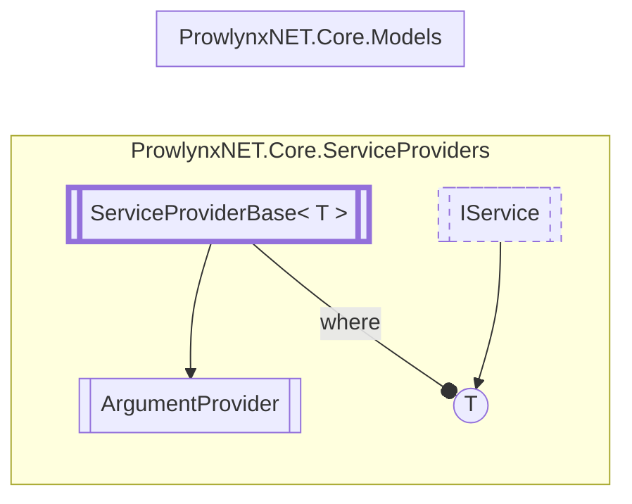

# ArgumentProvider `Public class`

## Description
The provider for protection arguments.

## Diagram


## Details
### Summary
The provider for protection arguments.

### Inheritance
 - [`ServiceProviderBase`](./ServiceProviderBaseT.md)&lt;[`IArgumentService`](../models/services/IArgumentService.md)&gt;

### Constructors
#### ArgumentProvider
```csharp
public ArgumentProvider()
```

*Generated with* [*ModularDoc*](https://github.com/hailstorm75/ModularDoc)
