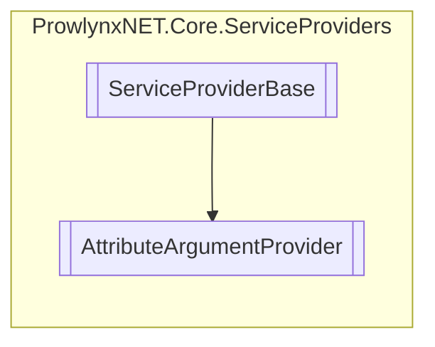

# AttributeArgumentProvider `Public class`

## Description
The attribute argument provider for the [AttributeArgumentService](../services/argument/AttributeArgumentService.md) .

## Diagram


## Details
### Summary
The attribute argument provider for the [AttributeArgumentService](../services/argument/AttributeArgumentService.md) .

### Inheritance
 - `ServiceProviderBase`&lt;[`IAttributeArgumentService`](../models/services/IAttributeArgumentServiceT.md)&lt;[`ArgumentInfo`](../services/argument/ArgumentInfo.md)&gt;&gt;

### Constructors
#### AttributeArgumentProvider
[*Source code*](https://github.com///blob//ProwlynxNET.Core/ServiceProviders/AttributeArgumentProvider.cs#L21)
```csharp
public AttributeArgumentProvider()
```
##### Summary
Create a new attribute argument provider adding a single [AttributeArgumentService](../services/argument/AttributeArgumentService.md) service.

*Generated with* [*ModularDoc*](https://github.com/hailstorm75/ModularDoc)
