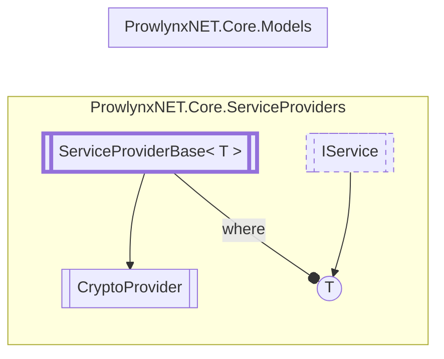

# CryptoProvider `Public class`

## Description
The cryptography provider.

## Diagram


## Details
### Summary
The cryptography provider.

### Inheritance
 - [`ServiceProviderBase`](./ServiceProviderBaseT.md)&lt;[`ICryptoService`](../models/services/ICryptoService.md)&gt;

### Constructors
#### CryptoProvider
```csharp
public CryptoProvider()
```

*Generated with* [*ModularDoc*](https://github.com/hailstorm75/ModularDoc)
