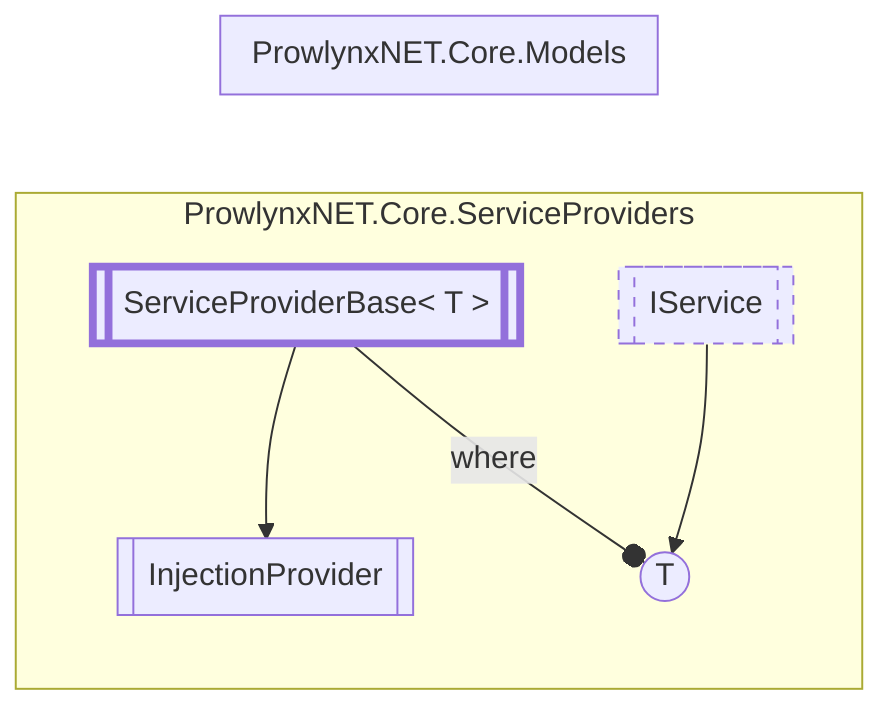

# InjectionProvider `Public class`

## Description
The injection provider for [InjectorService](../services/injector/InjectorService.md) .

## Diagram


## Details
### Summary
The injection provider for [InjectorService](../services/injector/InjectorService.md) .

### Inheritance
 - [`ServiceProviderBase`](./ServiceProviderBaseT.md)&lt;[`IInjectionService`](../models/services/IInjectionService.md)&gt;

### Constructors
#### InjectionProvider
[*Source code*](https://github.com///blob//ProwlynxNET.Core/ServiceProviders/InjectionProvider.cs#L21)
```csharp
public InjectionProvider()
```
##### Summary
Create a new injection provider adding a single [InjectorService](../services/injector/InjectorService.md) service.

*Generated with* [*ModularDoc*](https://github.com/hailstorm75/ModularDoc)
