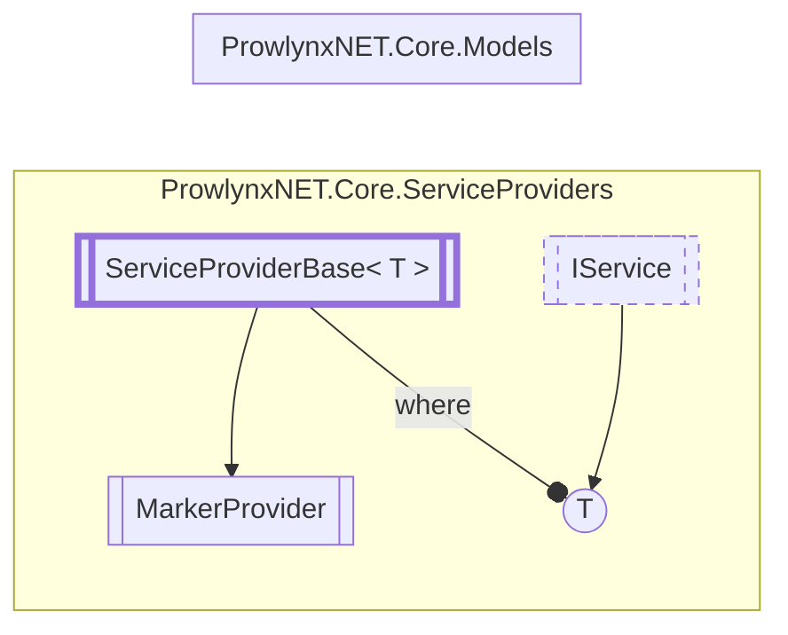

# MarkerProvider `Public class`

## Description
The marker provider for the [MarkerService](../services/marker/MarkerService.md) .

## Diagram


## Details
### Summary
The marker provider for the [MarkerService](../services/marker/MarkerService.md) .

### Inheritance
 - [`ServiceProviderBase`](./ServiceProviderBaseT.md)&lt;[`IMarkerService`](../models/services/IMarkerService.md)&gt;

### Constructors
#### MarkerProvider
[*Source code*](https://github.com///blob//ProwlynxNET.Core/ServiceProviders/MarkerProvider.cs#L21)
```csharp
public MarkerProvider()
```
##### Summary
Create a new marker provider adding a single [MarkerService](../services/marker/MarkerService.md) service.

*Generated with* [*ModularDoc*](https://github.com/hailstorm75/ModularDoc)
