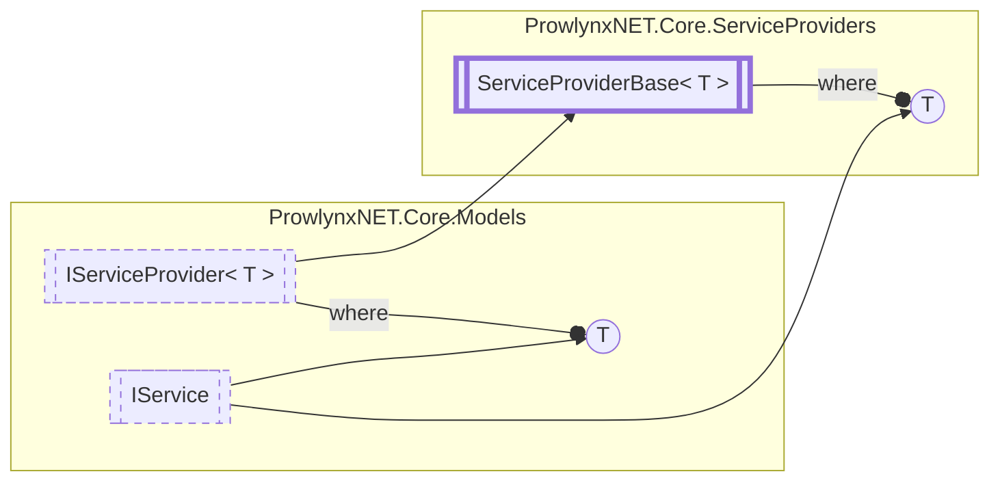

# ServiceProviderBase&lt;T&gt; `Public class`

## Description
All service providers inherit from this class.

## Diagram


## Members
### Properties
#### Public  properties
| Type | Name | Methods |
| --- | --- | --- |
| `T` | [`First`](#first)<br>Get the first service from the service list (or null). | `get` |
| `T` | [`Item`](#item) | `get` |
| `T` | [`Item`](#item) | `get` |
| `T` | [`Last`](#last)<br>Get the last service from the service list (or null). | `get` |
| `List`&lt;`T`&gt; | [`Services`](#services)<br>The list of services the provider supplies | `get` |

### Methods
#### Public  methods
| Returns | Name |
| --- | --- |
| `void` | [`AddService`](#addservice)(`T` service) |
| `T` | [`GetService`](#getservice)(`string` serviceName)<br>Get a particular [IService](../models/IService.md) with the unique service name. |

## Details
### Summary
All service providers inherit from this class.

### Generic types
| Type | Description | Constraints |
| --- | --- | --- |
| `T` | The type of service the service provider will provide | [`IService`](../models/IService.md) |

### Inheritance
 - [`IServiceProvider`](../models/IServiceProviderT.md)&lt;`T`&gt;

### Constructors
#### ServiceProviderBase
[*Source code*](https://github.com///blob//ProwlynxNET.Core/ServiceProviders/ServiceProviderBase.cs#L19)
```csharp
protected ServiceProviderBase()
```

### Methods
#### GetService
[*Source code*](https://github.com///blob//ProwlynxNET.Core/ServiceProviders/ServiceProviderBase.cs#L16707566)
```csharp
public virtual T GetService(string serviceName)
```
##### Arguments
| Type | Name | Description |
| --- | --- | --- |
| `string` | serviceName | The service name |

##### Summary
Get a particular [IService](../models/IService.md) with the unique service name.

##### Returns
The related service, or null

#### AddService
[*Source code*](https://github.com///blob//ProwlynxNET.Core/ServiceProviders/ServiceProviderBase.cs#L57)
```csharp
public virtual void AddService(T service)
```
##### Arguments
| Type | Name | Description |
| --- | --- | --- |
| `T` | service |   |

### Properties
#### Services
```csharp
public virtual List<T> Services { get; }
```
##### Summary
The list of services the provider supplies

#### First
```csharp
public T First { get; }
```
##### Summary
Get the first service from the service list (or null).

#### Last
```csharp
public T Last { get; }
```
##### Summary
Get the last service from the service list (or null).

#### Item
```csharp
public T Item { get; }
```

#### Item
```csharp
public T Item { get; }
```

*Generated with* [*ModularDoc*](https://github.com/hailstorm75/ModularDoc)
