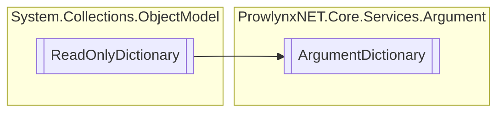

# ArgumentDictionary `Public class`

## Description
A read-only dictionary for arguments.

## Diagram


## Members
### Properties
#### Public  properties
| Type | Name | Methods |
| --- | --- | --- |
| `string` | [`Item`](#item) | `get, set` |

## Details
### Summary
A read-only dictionary for arguments.

### Inheritance
 - `ReadOnlyDictionary`&lt;`string`, `string`&gt;

### Constructors
#### ArgumentDictionary
[*Source code*](https://github.com///blob//ProwlynxNET.Core/Services/Argument/ArgumentDictionary.cs#L34)
```csharp
public ArgumentDictionary(IDictionary<string, string> dictionary)
```
##### Arguments
| Type | Name | Description |
| --- | --- | --- |
| `IDictionary`&lt;`string`, `string`&gt; | dictionary |   |

### Properties
#### Item
```csharp
public string Item { get; set; }
```

*Generated with* [*ModularDoc*](https://github.com/hailstorm75/ModularDoc)
