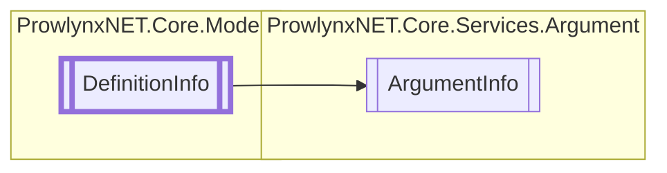

# ArgumentInfo `Public class`

## Description
A record of arguments for a particular definition.

## Diagram


## Members
### Properties
#### Public  properties
| Type | Name | Methods |
| --- | --- | --- |
| `bool` | [`ApplyToMembers`](#applytomembers)<br>Whether or not the arguments should appear to lower members. | `get, set` |
| `Dictionary`&lt;`string`, `string`&gt; | [`Arguments`](#arguments)<br>The dictionary holding the arguments. | `get, set` |
| `bool` | [`Exclude`](#exclude)<br>Whether to exclude the arguments. | `get, set` |
| `string` | [`Name`](#name)<br>The unique protection name that the arguments apply to. | `get, set` |

## Details
### Summary
A record of arguments for a particular definition.

### Inheritance
 - [
`DefinitionInfo`
](../../models/DefinitionInfo.md)

### Constructors
#### ArgumentInfo [1/2]
[*Source code*](https://github.com///blob//ProwlynxNET.Core/Services/Argument/ArgumentInfo.cs#L35)
```csharp
public ArgumentInfo()
```
##### Summary
Create a new argument info with an empty argument dictionary.

#### ArgumentInfo [2/2]
[*Source code*](https://github.com///blob//ProwlynxNET.Core/Services/Argument/ArgumentInfo.cs#L35)
```csharp
public ArgumentInfo(string rawArguments)
```
##### Arguments
| Type | Name | Description |
| --- | --- | --- |
| `string` | rawArguments | The raw arguments to use. |

##### Summary
Create a new argument info using the specified raw arguments. Raw arguments take the form of "key = value".
                Optionally the key and value may be wrapped in single quotes so special characters like the "=", "," and " " can be
                used.

### Properties
#### ApplyToMembers
```csharp
public bool ApplyToMembers { get; set; }
```
##### Summary
Whether or not the arguments should appear to lower members.

#### Name
```csharp
public string Name { get; set; }
```
##### Summary
The unique protection name that the arguments apply to.

#### Exclude
```csharp
public bool Exclude { get; set; }
```
##### Summary
Whether to exclude the arguments.

#### Arguments
```csharp
public Dictionary<string, string> Arguments { get; set; }
```
##### Summary
The dictionary holding the arguments.

*Generated with* [*ModularDoc*](https://github.com/hailstorm75/ModularDoc)
