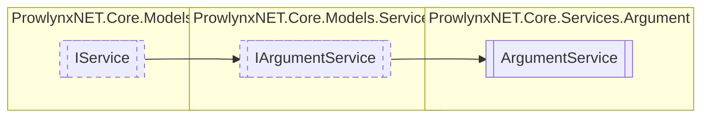

# ArgumentService `Public class`

## Description
An argument service for a single IProtection .

## Diagram


## Members
### Properties
#### Public  properties
| Type | Name | Methods |
| --- | --- | --- |
| `NameValueCollection` | [`Arguments`](#arguments)<br>The list of arguments for a particular [IProtection](../../models/IProtection.md) | `get, set` |
| `string` | [`Description`](#description)<br>Description of the service. | `get` |
| `string` | [`Item`](#item) | `get, set` |
| `string` | [`Name`](#name)<br>The unique name of the service. | `get, set` |

### Methods
#### Public  methods
| Returns | Name |
| --- | --- |
| `void` | [`Add`](#add)(`string` name, `string` value)<br>Add an argument to the current argument service. |
| `bool` | [`Has`](#has)(`string` name)<br>Check whether the argument name exists. |

## Details
### Summary
An argument service for a single IProtection .

### Inheritance
 - [
`IArgumentService`
](../../models/services/IArgumentService.md)
 - [
`IService`
](../../models/IService.md)

### Constructors
#### ArgumentService
[*Source code*](https://github.com///blob//ProwlynxNET.Core/Services/Argument/ArgumentService.cs#L42)
```csharp
public ArgumentService(string protectionName)
```
##### Arguments
| Type | Name | Description |
| --- | --- | --- |
| `string` | protectionName | The unique name for the protection. |

##### Summary
Create an argument service for a particular IProtection .

### Methods
#### Add
[*Source code*](https://github.com///blob//ProwlynxNET.Core/Services/Argument/ArgumentService.cs#L54)
```csharp
public virtual void Add(string name, string value)
```
##### Arguments
| Type | Name | Description |
| --- | --- | --- |
| `string` | name | The name of the argument (key) |
| `string` | value | The value of the argument |

##### Summary
Add an argument to the current argument service.

#### Has
[*Source code*](https://github.com///blob//ProwlynxNET.Core/Services/Argument/ArgumentService.cs#L60)
```csharp
public virtual bool Has(string name)
```
##### Arguments
| Type | Name | Description |
| --- | --- | --- |
| `string` | name | The name of the argument (key) passed in when added. |

##### Summary
Check whether the argument name exists.

##### Returns
Whether or not the argument exists.

### Properties
#### Name
```csharp
public string Name { get; set; }
```
##### Summary
The unique name of the service.

#### Description
```csharp
public virtual string Description { get; }
```
##### Summary
Description of the service.

#### Arguments
```csharp
public NameValueCollection Arguments { get; set; }
```
##### Summary
The list of arguments for a particular [IProtection](../../models/IProtection.md)

#### Item
```csharp
public virtual string Item { get; set; }
```

*Generated with* [*ModularDoc*](https://github.com/hailstorm75/ModularDoc)
