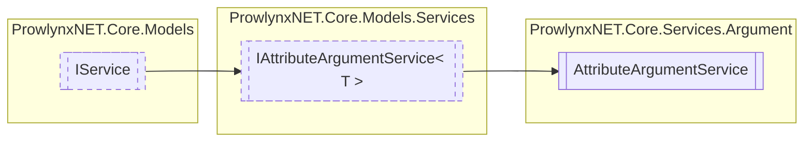

# AttributeArgumentService `Public class`

## Description
A service that handles arguments passed to protections via an attribute on a definition.

## Diagram


## Members
### Properties
#### Public  properties
| Type | Name | Methods |
| --- | --- | --- |
| `List`&lt;[`ArgumentInfo`](./ArgumentInfo.md)&gt; | [`Database`](#database)<br>A database storing [ArgumentInfo](./ArgumentInfo.md) s for the service. | `get` |
| `string` | [`Description`](#description)<br>Description of the service. | `get` |
| `string` | [`Name`](#name)<br>The unique name of the service. | `get` |

### Methods
#### Public  methods
| Returns | Name |
| --- | --- |
| `void` | [`Add`](#add-12)(`...`)<br>Add or update an argument for a specific definition for a protection. |
| `bool` | [`Exists`](#exists)(`IMemberDefinition` definition, `string` protectionName)<br>Check whether an entry exists for a definition for the specified protection. |
| [`ArgumentDictionary`](./ArgumentDictionary.md) | [`GetArguments`](#getarguments)([`IProtection`](../../models/IProtection.md) protection, `IMemberDefinition` definition)<br>Get arguments that originated from an attribute for a specific protection that are applied to a specific<br>                definition. |

## Details
### Summary
A service that handles arguments passed to protections via an attribute on a definition.

### Inheritance
 - [`IAttributeArgumentService`](../../models/services/IAttributeArgumentServiceT.md)&lt;[`ArgumentInfo`](./ArgumentInfo.md)&gt;
 - [
`IService`
](../../models/IService.md)

### Constructors
#### AttributeArgumentService
[*Source code*](https://github.com///blob//ProwlynxNET.Core/Services/Argument/AttributeArgumentService.cs#L21)
```csharp
public AttributeArgumentService()
```

### Methods
#### Add [1/2]
[*Source code*](https://github.com///blob//ProwlynxNET.Core/Services/Argument/AttributeArgumentService.cs#L16707566)
```csharp
public virtual void Add(IMemberDefinition definition, string protectionName, string name, string value, bool applyToMembers)
```
##### Arguments
| Type | Name | Description |
| --- | --- | --- |
| `IMemberDefinition` | definition | The definition. |
| `string` | protectionName | The [IProtection](../../models/IProtection.md) name. |
| `string` | name | The name (key) of the argument. |
| `string` | value | The value of the argument. |
| `bool` | applyToMembers | Whether to apply the argument to descending members. |

##### Summary
Add or update an argument for a specific definition for a protection.

#### Add [2/2]
[*Source code*](https://github.com///blob//ProwlynxNET.Core/Services/Argument/AttributeArgumentService.cs#L16707566)
```csharp
public virtual void Add(ArgumentInfo info)
```
##### Arguments
| Type | Name | Description |
| --- | --- | --- |
| [`ArgumentInfo`](./ArgumentInfo.md) | info | The argument to add or update the existing. |

##### Summary
Add or update an argument from a given argument.

#### Exists
[*Source code*](https://github.com///blob//ProwlynxNET.Core/Services/Argument/AttributeArgumentService.cs#L16707566)
```csharp
public virtual bool Exists(IMemberDefinition definition, string protectionName)
```
##### Arguments
| Type | Name | Description |
| --- | --- | --- |
| `IMemberDefinition` | definition | The definition. |
| `string` | protectionName | The [IProtection](../../models/IProtection.md) name. |

##### Summary
Check whether an entry exists for a definition for the specified protection.

##### Returns
Whether an entry exists.

#### GetArguments
[*Source code*](https://github.com///blob//ProwlynxNET.Core/Services/Argument/AttributeArgumentService.cs#L16707566)
```csharp
public virtual ArgumentDictionary GetArguments(IProtection protection, IMemberDefinition definition)
```
##### Arguments
| Type | Name | Description |
| --- | --- | --- |
| [`IProtection`](../../models/IProtection.md) | protection | The protection. |
| `IMemberDefinition` | definition | The definition. |

##### Summary
Get arguments that originated from an attribute for a specific protection that are applied to a specific
                definition.

##### Returns
The list of arguments.

### Properties
#### Database
```csharp
public virtual List<ArgumentInfo> Database { get; }
```
##### Summary
A database storing [ArgumentInfo](./ArgumentInfo.md) s for the service.

#### Name
```csharp
public virtual string Name { get; }
```
##### Summary
The unique name of the service.

#### Description
```csharp
public virtual string Description { get; }
```
##### Summary
Description of the service.

*Generated with* [*ModularDoc*](https://github.com/hailstorm75/ModularDoc)
