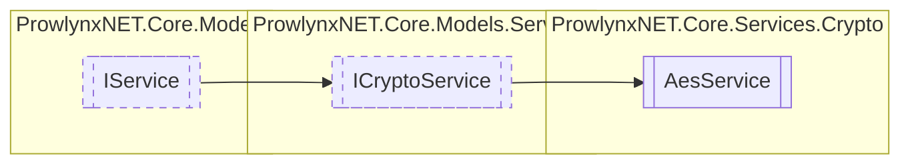

# AesService `Public class`

## Description
A basic AES service with some customisability.

## Diagram


## Members
### Properties
#### Public  properties
| Type | Name | Methods |
| --- | --- | --- |
| `byte``[]` | [`AdditionalData`](#additionaldata)<br>The AES IV, this is randomly generated and prepended to the data every encryption. | `get, set` |
| `CipherMode` | [`AesCipherMode`](#aesciphermode)<br>The cipher mode to use when encrypting and decrypting. | `get, set` |
| `int` | [`AesKeySize`](#aeskeysize)<br>The Aes Key Size: 64, 128, 256. | `get, set` |
| `string` | [`Description`](#description)<br>Description of the service. | `get` |
| `byte``[]` | [`Key`](#key)<br>The AES Key. When set, will derive a key from the bytes passed to it. <br>            This is the true key, do not assume the key you give it will become the true key. | `get, set` |
| `string` | [`Name`](#name)<br>The unique name of the service. | `get` |

### Methods
#### Public  methods
| Returns | Name |
| --- | --- |
| `byte``[]` | [`Decrypt`](#decrypt)(`byte``[]` data)<br>Decrypt using the set mode of AES. |
| `byte``[]` | [`Encrypt`](#encrypt)(`byte``[]` data)<br>Encrypt using the set mode of AES. |

## Details
### Summary
A basic AES service with some customisability.

### Inheritance
 - [
`ICryptoService`
](../../models/services/ICryptoService.md)
 - [
`IService`
](../../models/IService.md)

### Constructors
#### AesService
[*Source code*](https://github.com///blob//ProwlynxNET.Core/Services/Crypto/AesService.cs#L43)
```csharp
public AesService()
```

### Methods
#### Encrypt
[*Source code*](https://github.com///blob//ProwlynxNET.Core/Services/Crypto/AesService.cs#L56)
```csharp
public virtual byte Encrypt(byte[] data)
```
##### Arguments
| Type | Name | Description |
| --- | --- | --- |
| `byte``[]` | data | Raw data. |

##### Summary
Encrypt using the set mode of AES.

##### Returns
The encrypted bytes.

#### Decrypt
[*Source code*](https://github.com///blob//ProwlynxNET.Core/Services/Crypto/AesService.cs#L96)
```csharp
public virtual byte Decrypt(byte[] data)
```
##### Arguments
| Type | Name | Description |
| --- | --- | --- |
| `byte``[]` | data | Encrypted data. |

##### Summary
Decrypt using the set mode of AES.

##### Returns
The decrypted bytes.

### Properties
#### Key
```csharp
public virtual byte Key { get; set; }
```
##### Summary
The AES Key. When set, will derive a key from the bytes passed to it. 
            This is the true key, do not assume the key you give it will become the true key.

#### AdditionalData
```csharp
public virtual byte AdditionalData { get; set; }
```
##### Summary
The AES IV, this is randomly generated and prepended to the data every encryption.

#### Name
```csharp
public virtual string Name { get; }
```
##### Summary
The unique name of the service.

#### Description
```csharp
public virtual string Description { get; }
```
##### Summary
Description of the service.

#### AesCipherMode
```csharp
public CipherMode AesCipherMode { get; set; }
```
##### Summary
The cipher mode to use when encrypting and decrypting.

#### AesKeySize
```csharp
public int AesKeySize { get; set; }
```
##### Summary
The Aes Key Size: 64, 128, 256.

*Generated with* [*ModularDoc*](https://github.com/hailstorm75/ModularDoc)
