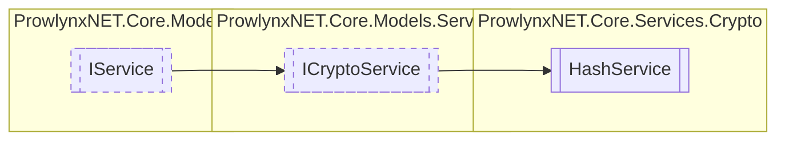

# HashService `Public class`

## Description
Basic Hash Service class providing some mini functions.

## Diagram


## Members
### Properties
#### Public  properties
| Type | Name | Methods |
| --- | --- | --- |
| `byte``[]` | [`AdditionalData`](#additionaldata)<br>Not implemented. | `get, set` |
| `string` | [`Description`](#description)<br>Description of the service. | `get` |
| `byte``[]` | [`Key`](#key)<br>Not implemented. | `get, set` |
| `string` | [`Name`](#name)<br>The unique name of the service. | `get` |

### Methods
#### Public  methods
| Returns | Name |
| --- | --- |
| `byte``[]` | [`Decrypt`](#decrypt)(`byte``[]` data)<br>Not implemented. |
| `byte``[]` | [`Encrypt`](#encrypt)(`byte``[]` data)<br>Not implemented. |
| `byte``[]` | [`SHA1Hash`](#sha1hash)(`byte``[]` data)<br>Provide a SHA1 Hash of the byte data. |
| `byte``[]` | [`SHA256Hash`](#sha256hash)(`byte``[]` data)<br>Provide a SHA256 Hash of the byte data. |

## Details
### Summary
Basic Hash Service class providing some mini functions.

### Inheritance
 - [
`ICryptoService`
](../../models/services/ICryptoService.md)
 - [
`IService`
](../../models/IService.md)

### Constructors
#### HashService
```csharp
public HashService()
```

### Methods
#### Decrypt
[*Source code*](https://github.com///blob//ProwlynxNET.Core/Services/Crypto/HashService.cs#L38)
```csharp
public virtual byte Decrypt(byte[] data)
```
##### Arguments
| Type | Name | Description |
| --- | --- | --- |
| `byte``[]` | data |  |

##### Summary
Not implemented.

##### Returns


##### Exceptions
| Name | Description |
| --- | --- |
| NotImplementedException |  |

#### Encrypt
[*Source code*](https://github.com///blob//ProwlynxNET.Core/Services/Crypto/HashService.cs#L49)
```csharp
public virtual byte Encrypt(byte[] data)
```
##### Arguments
| Type | Name | Description |
| --- | --- | --- |
| `byte``[]` | data |  |

##### Summary
Not implemented.

##### Returns


##### Exceptions
| Name | Description |
| --- | --- |
| NotImplementedException |  |

#### SHA1Hash
[*Source code*](https://github.com///blob//ProwlynxNET.Core/Services/Crypto/HashService.cs#L59)
```csharp
public byte SHA1Hash(byte[] data)
```
##### Arguments
| Type | Name | Description |
| --- | --- | --- |
| `byte``[]` | data | Data to hash |

##### Summary
Provide a SHA1 Hash of the byte data.

##### Returns
Hash bytes, use [Utils](../../extensions/Utils.md).ToHexString(System.Byte[]) to retrieve a string.

#### SHA256Hash
[*Source code*](https://github.com///blob//ProwlynxNET.Core/Services/Crypto/HashService.cs#L69)
```csharp
public byte SHA256Hash(byte[] data)
```
##### Arguments
| Type | Name | Description |
| --- | --- | --- |
| `byte``[]` | data | Data to hash |

##### Summary
Provide a SHA256 Hash of the byte data.

##### Returns
Hash bytes, use [Utils](../../extensions/Utils.md).ToHexString(System.Byte[]) to retrieve a string.

### Properties
#### Key
```csharp
public virtual byte Key { get; set; }
```
##### Summary
Not implemented.

#### AdditionalData
```csharp
public virtual byte AdditionalData { get; set; }
```
##### Summary
Not implemented.

#### Name
```csharp
public virtual string Name { get; }
```
##### Summary
The unique name of the service.

#### Description
```csharp
public virtual string Description { get; }
```
##### Summary
Description of the service.

*Generated with* [*ModularDoc*](https://github.com/hailstorm75/ModularDoc)
