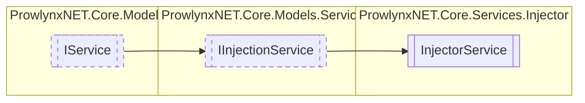

# InjectorService `Public class`

## Description
The primary injector for injecting types into a target module.

## Diagram


## Members
### Properties
#### Public  properties
| Type | Name | Methods |
| --- | --- | --- |
| `string` | [`Description`](#description)<br>Description of the service. | `get` |
| `string` | [`Name`](#name)<br>The unique name of the service. | `get` |

### Methods
#### Public  methods
| Returns | Name |
| --- | --- |
| `IList`&lt;`TypeDefinition`&gt; | [`Inject`](#inject-13)(`...`) |

## Details
### Summary
The primary injector for injecting types into a target module.

### Inheritance
 - [
`IInjectionService`
](../../models/services/IInjectionService.md)
 - [
`IService`
](../../models/IService.md)

### Constructors
#### InjectorService
```csharp
public InjectorService()
```

### Methods
#### Inject [1/3]
[*Source code*](https://github.com///blob//ProwlynxNET.Core/Services/Injector/InjectorService.cs#L27)
```csharp
public virtual IList<TypeDefinition> Inject(ModuleDefinition injectModule, ModuleDefinition target)
```
##### Arguments
| Type | Name | Description |
| --- | --- | --- |
| `ModuleDefinition` | injectModule |   |
| `ModuleDefinition` | target |   |

#### Inject [2/3]
[*Source code*](https://github.com///blob//ProwlynxNET.Core/Services/Injector/InjectorService.cs#L42)
```csharp
public virtual IMemberDefinition Inject(IMemberDefinition def, ModuleDefinition target)
```
##### Arguments
| Type | Name | Description |
| --- | --- | --- |
| `IMemberDefinition` | def |   |
| `ModuleDefinition` | target |   |

#### Inject [3/3]
[*Source code*](https://github.com///blob//ProwlynxNET.Core/Services/Injector/InjectorService.cs#L50)
```csharp
public virtual IList<IMemberDefinition> Inject(IEnumerable<IMemberDefinition> def, ModuleDefinition target)
```
##### Arguments
| Type | Name | Description |
| --- | --- | --- |
| `IEnumerable`&lt;`IMemberDefinition`&gt; | def |   |
| `ModuleDefinition` | target |   |

### Properties
#### Name
```csharp
public virtual string Name { get; }
```
##### Summary
The unique name of the service.

#### Description
```csharp
public virtual string Description { get; }
```
##### Summary
Description of the service.

*Generated with* [*ModularDoc*](https://github.com/hailstorm75/ModularDoc)
