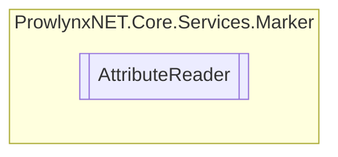

# AttributeReader `Public class`

## Description
Processes attributes in an [ObfuscationTask](../../ObfuscationTask.md) module.
                Adds them to the [MarkerService](./MarkerService.md) .

## Diagram


## Members
### Methods
#### Public  methods
| Returns | Name |
| --- | --- |
| `void` | [`Read`](#read)([`ObfuscationTask`](../../ObfuscationTask.md) task)<br>Read and add to the marker the obfuscation information stored in attributes. |

## Details
### Summary
Processes attributes in an [ObfuscationTask](../../ObfuscationTask.md) module.
                Adds them to the [MarkerService](./MarkerService.md) .

### Constructors
#### AttributeReader
[*Source code*](https://github.com///blob//ProwlynxNET.Core/Services/Marker/AttributeReader.cs#L23)
```csharp
public AttributeReader()
```

### Methods
#### Read
[*Source code*](https://github.com///blob//ProwlynxNET.Core/Services/Marker/AttributeReader.cs#L40)
```csharp
public void Read(ObfuscationTask task)
```
##### Arguments
| Type | Name | Description |
| --- | --- | --- |
| [`ObfuscationTask`](../../ObfuscationTask.md) | task | The obfuscation task. |

##### Summary
Read and add to the marker the obfuscation information stored in attributes.

*Generated with* [*ModularDoc*](https://github.com/hailstorm75/ModularDoc)
