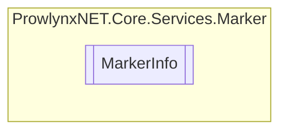

# MarkerInfo `Public class`

## Description
A class for marker information.

## Diagram


## Members
### Properties
#### Public  properties
| Type | Name | Methods |
| --- | --- | --- |
| `List`&lt;[`ObfuscationInfo`](./ObfuscationInfo.md)&gt; | [`Obfuscations`](#obfuscations)<br>The obfuscation information for the [MarkerService](./MarkerService.md) . | `get, set` |

## Details
### Summary
A class for marker information.

### Constructors
#### MarkerInfo
[*Source code*](https://github.com///blob//ProwlynxNET.Core/Services/Marker/MarkerInfo.cs#L20)
```csharp
public MarkerInfo()
```

### Properties
#### Obfuscations
```csharp
public List<ObfuscationInfo> Obfuscations { get; set; }
```
##### Summary
The obfuscation information for the [MarkerService](./MarkerService.md) .

*Generated with* [*ModularDoc*](https://github.com/hailstorm75/ModularDoc)
