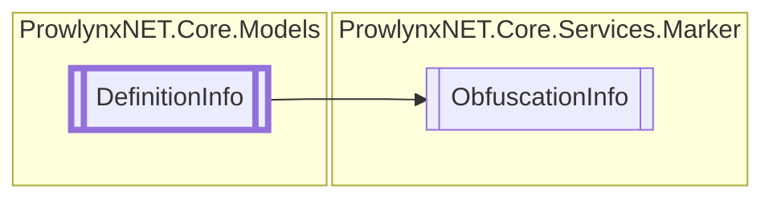

# ObfuscationInfo `Public class`

## Description
Information about a type/method definition in the target assembly and whether it can be processed by a [IProtection](../../models/IProtection.md) .

## Diagram


## Members
### Properties
#### Public  properties
| Type | Name | Methods |
| --- | --- | --- |
| `bool` | [`ApplyToMembers`](#applytomembers)<br>Whether to apply the same rule to nested members (methods inside a type definition normally). | `get, set` |
| `bool` | [`Exclude`](#exclude)<br>Whether to exclude the execution of the [ObfuscationInfo](prowlynxnet/core/services/marker/ObfuscationInfo.md).[Name](#name) . | `get, set` |
| `string` | [`Name`](#name)<br>The name of the [IProtection](../../models/IProtection.md) . | `get, set` |

## Details
### Summary
Information about a type/method definition in the target assembly and whether it can be processed by a [IProtection](../../models/IProtection.md) .

### Inheritance
 - [
`DefinitionInfo`
](../../models/DefinitionInfo.md)

### Constructors
#### ObfuscationInfo
```csharp
public ObfuscationInfo()
```

### Properties
#### Name
```csharp
public string Name { get; set; }
```
##### Summary
The name of the [IProtection](../../models/IProtection.md) .

#### Exclude
```csharp
public bool Exclude { get; set; }
```
##### Summary
Whether to exclude the execution of the [ObfuscationInfo](prowlynxnet/core/services/marker/ObfuscationInfo.md).[Name](#name) .

#### ApplyToMembers
```csharp
public bool ApplyToMembers { get; set; }
```
##### Summary
Whether to apply the same rule to nested members (methods inside a type definition normally).

*Generated with* [*ModularDoc*](https://github.com/hailstorm75/ModularDoc)
