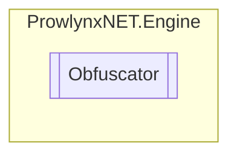

# Obfuscator `Public class`

## Description
A task runner to process [ObfuscationTask](../core/ObfuscationTask.md) s.

## Diagram


## Members
### Methods
#### Public  methods
| Returns | Name |
| --- | --- |
| [`ObfuscationTask`](../core/ObfuscationTask.md) | [`CreateTask`](#createtask)(`string` moduleFilePath)<br>Create a task from a module file path and return it. |
| `void` | [`RunTask`](#runtask)([`ObfuscationTask`](../core/ObfuscationTask.md) task)<br>Run an [ObfuscationTask](../core/ObfuscationTask.md) and write it to disk. |

## Details
### Summary
A task runner to process [ObfuscationTask](../core/ObfuscationTask.md) s.

### Constructors
#### Obfuscator
[*Source code*](https://github.com///blob//ProwlynxNET/Engine/Obfuscator.cs#L39)
```csharp
public Obfuscator()
```
##### Summary
Creates a new Obfuscator task runner.

### Methods
#### CreateTask
[*Source code*](https://github.com///blob//ProwlynxNET/Engine/Obfuscator.cs#L61)
```csharp
public ObfuscationTask CreateTask(string moduleFilePath)
```
##### Arguments
| Type | Name | Description |
| --- | --- | --- |
| `string` | moduleFilePath | The fullpath to the module. |

##### Summary
Create a task from a module file path and return it.

##### Returns
The created task, ready to be ran.

#### RunTask
[*Source code*](https://github.com///blob//ProwlynxNET/Engine/Obfuscator.cs#L74)
```csharp
public void RunTask(ObfuscationTask task)
```
##### Arguments
| Type | Name | Description |
| --- | --- | --- |
| [`ObfuscationTask`](../core/ObfuscationTask.md) | task |  |

##### Summary
Run an [ObfuscationTask](../core/ObfuscationTask.md) and write it to disk.

*Generated with* [*ModularDoc*](https://github.com/hailstorm75/ModularDoc)
