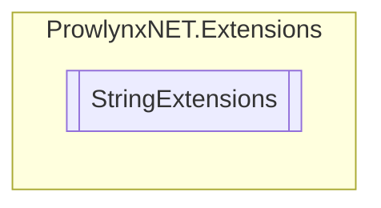

# StringExtensions `Public class`

## Description
Collection of extension methods that operate exclusively on strings.

## Diagram


## Members
### Methods
#### Public Static methods
| Returns | Name |
| --- | --- |
| `string` | [`GetFilePath`](#getfilepath)(`string` filePath, `string` brand)<br>Get a custom branded file path, defaults to _unnamed |

## Details
### Summary
Collection of extension methods that operate exclusively on strings.

### Methods
#### GetFilePath
[*Source code*](https://github.com///blob//ProwlynxNET/Extensions/StringExtensions.cs#L23)
```csharp
public static string GetFilePath(string filePath, string brand)
```
##### Arguments
| Type | Name | Description |
| --- | --- | --- |
| `string` | filePath | The filepath to brand. |
| `string` | brand | The brand to give it (goes after the file name, but before the extension. |

##### Summary
Get a custom branded file path, defaults to _unnamed

##### Returns
A full file path with the custom brand (C:\something_brandhere.exe).

*Generated with* [*ModularDoc*](https://github.com/hailstorm75/ModularDoc)
